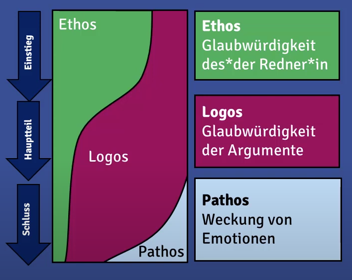

# Regeln

## Video 1: Äußerer Ramen in Präsentation

### Äußerer Rahmen / äußere Struktur

Adressiert die W-Fragen:

- Warum?
- Wann?
- Wem?
- Was?
- Wie?
- Wo?
- ...

### Warum?

Zielsetzung der Präsentation

- Ziel formulieren
- Zielbereiche: Überzeugen & Informieren

Möchte ich Informieren und die Entscheidung dem Publikum überlassen, der möchte ich das Publikum von meiner Entscheidung überzeugen?

### Wann?

Zeitpunkt & Dauer der Präsentation

- Mit oder ohne Diskussion?
- Was ist davor? Was danach?
- Zeit nutzen: Weder zu lange noch zu kurz reden

### Wem?

Publikum der Präsentation

- Wer sind die Zuhörer*innen?
- Warum sind sie da?
- Publikumsorientierung: Zuhörer*innen dort abholen, wo sie stehen

(Wer genau sind unsere Zuhörer? Wahrscheinlich sollten die Dozierenden im Fokus stehen, da diese die Entscheidungskraft tragen.)

### Was?

Inhalt der Präsentation

- Thema und Ziel bestimmen Inhalt und Struktur
- Selbstpräsentation

Unterschied zwischen Wie- & Ja-Nein-Aussagen

### Wo?

Ort der Präsentation

- Eigenschaften des Raums z.B. Raumausstattung

### Wie?

Art und Weise der Präsentation

- Methodik
- Stimme & Sprache
- Medieneinsatz

Allgemeine Spielregeln beachten. Wem? Muss vorher geklärt sein!

## Video 2: Innerer Rahmen in Präsentationen

### Innerer Rahmen / innere Struktur (Aufbau)

### Struktur

Klar, einfach schnell, zwingend, d.h. das Eine ergibt sich aus dem Anderen, alles ist immer folgerichtig, Publikum kann folgen

Zu Vermeiden:

- Abschweifungen
- Ausschmückungen
- Polemik & Attacken
- Selbstabwertung (Bsp. "meine Wenigkeit", Entschuldigung für Serverversagen in Form von "hätte ich besser vorbereiten müssen")

Da das Publikum nicht die gesamte Zeit konzentriert zuhören kann, sind Auflockerungen sinnvoll:

### Einleitung

Grundsätzliche Struktur:

- Thema nennen oder zeigen
- Selbstdarstellung
- Gliederung präsentieren
- Spielregeln verabreden
- Interesse wecken (Geschichte, Anekdote, Analogie, Metapher...)

Konkrete Methodik:

**Vorspann** zum Aufbau einer positiven Atmosphäre

- Komplimente an Vorredner*innen
- Witz, Anekdote. Zitat
- Persönliche Geschichte
- ...

(Themenbezug nicht wichtig; Humor muss passend gewählt sein!)

**Aufhänger** zur Vorbereitung des Themas

- Themen-Vorbereitendes Zitat, Witz, etc.
- Persönlicher Erlebnisbericht
- Aktuelle Pressemitteilungen
- Vergleiche
- Gemeinsame Erfahrungen
- ...

(Zitate, etc. müssen hierbei Bezug zum Thema haben)

**Denkanreiz** als direkter Einstieg in das Thema

- Themenstellung + Antwort
- Direkte Nennung der Hauptargumente
- Paradoxes Beispiel, rhetorische Frage + Antwort
- ...

**Status Quo** zur Schilderung der Ausgangssituation, die zu verbessern ist

- Kurze Schilderung des Status quo + Hinweis auf Un-Tragbarkeit der Situation + Lösungsmöglichkeiten etc.
- Probleme und Lösungsideen aus Sicht der Zielgruppe aufgreifen
- ...

(Probleme aus Sicht der Publikums betrachten)

### Hauptteil

Können wir ganz unterschiedlich gestalten

### Schluss

Grundsätzliche Struktur:

- Ende der Präsentation ankündigen
- Zusammenfassung
- Ausblick, Konsequenzen
- Brückenschlag zum Einstieg
- Positive Motivierung

### Überzeugungskraft

#### Ethos

- Kompetenz, die die Person ausstrahlt
- Integrität, meint die Person, was sie sagt?
- Wohlwollen, spricht der Person im eigenen oder in meinem Interesse?

#### Logos

- Sind die Inhalte überzeugend?
- Ist alles klar und verständlich formuliert?
- Ist alles folgerichtig?

negativ:

- Wirkt der Vortrag zusammengewürfelt?
- Ist der Schluss nicht nachvollziehbar?

#### Pathos

- Persönlichen Bezug zum Publikum schaffen

## Video 3: Selbstpräsentation in Präsentationen

### Die Selbstpräsentation

Teil der W-Frage Was? des äußeren Rahmens

Bei jeder Präsentation präsentiere ich automatisch mich selbst, meine Person und vor allem mein Auftreten.

### Glaubwürdigkeit

Ethos als persönliche Glaubwürdigkeit

- Kompetenz: habe ich Ahnung von dem, was ich zeige und vorstelle
- Integrität: meine ich, was ich sage oder versuche ich etwas zu verschleiern oder anders darzustellen
- Wohlwollen: spreche ich im Sinne des Publikums, oder versuche ich, etwas zu verkaufen
- Authentizität: wirke ich wie ich selbst oder wirke ich verstellt?

### Sprache

- Kürze & Prägnanz: "Eigentlich", "Ich würde meinen...", etc. vermeiden
- Angemessenheit der Sprache: Fachvokabular vor Kunden vermeiden, Gendern!, etc.
- Sinnvolle, bedachte Wortwahl: Klischees vermeidende, Lust- statt Frust-Worte, etc.

### Körpersprache

Nonverbale Signale

- Körperstellung & Gestik: dem Publikum zugewandt, Gestiken im Einklang zum Gesagten, Hände in Körpermitte und offen
- Blickkontakt & Mimik: Publikum im Auge behalten, Publikum ansprechen, Blickfokus variieren
- Stimme & Pausen: Wichtige Punkte durch Betonung klar machen, Lautstärke an räumliche Gegebenheiten anpassen, passende Pausen machen
- Kleidung & Style: keine Jogginghose, TShirt, verstrubbelte Haare, angemessen Kleiden und Stylen

### Sicherheit

im Auftreten gewinnen durch

- Planung und Vorbereitung
- Üben der Präsentation
- Feedback

## Video 4: Medieneinsatz in Präsentationen

### Der Medieneinsatz

Teil der W-Frage Wie? des äußeren Rahmens

### Wahl der Medien

Soll Vortrag unterstützen und nicht ersetzen, außerdem sind die kein Füllmaterial

- Rahmen des Vortrags: Welche Kanäle möchte in ansprechen, was benötige ich um das Thema zu visualisieren und darstellen, passt das Medium zum Publikum
- Integration in den Ablauf: Kann ich Medium gut in den Ablauf integrieren?
- Anforderungen an Visualisierung: Was muss mein Medium leisten können?

### Flipchart

In großen Räumen schwierig wegen Lesbarkeit

- Schrift & Lesbarkeit: Schriftgröße, Schriftsauberkeit, Groß- & Kleinschreibung
- Strukturierung durch Farben und Zeichen: + für positives, - für negatives, Haken fürs abhaken
- Benutzen des Flipcharts (z.B. interaktives Ergänzen)

### Folien & Beamer

- Folien als Unterstützung des Vortrags
- Kernaussagen & Schlagworte
- Leserlichkeit, Überfrachtung & Zahlenfriedhöfe: Diagramme besser als reine Zahlen
- Attraktivität durch Bild & Farben: Einheitliche und durchdachte Gestaltung der Folie
- Animationen & Folien Striptease: Weniger ist meist mehr
- Folien-Schlachten (mind. 90 Sekunden pro Folie)
- Vermeiden: Folien ohne Nutzen
